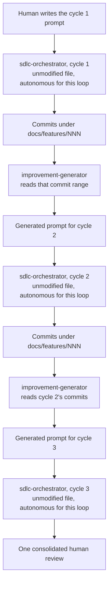

# Improvement Loop

> How to run a multi-cycle, commit-driven improvement loop using the **unmodified** `sdlc-orchestrator.md` plus the one new `improvement-generator.md` agent. This file is the recipe; it is not a second orchestrator and it does not change any existing `.claude/commands/*.md` file.

---

## The mechanism, in one paragraph

A human gives `sdlc-orchestrator` a normal feature prompt (cycle 1). The orchestrator runs its five states exactly as written in [`sdlc-orchestrator.md`](../../.claude/commands/sdlc-orchestrator.md) and produces commits under a `docs/features/<NNN>-<name>/` folder. Once that cycle's Docs Manager step finishes, invoke `improvement-generator` (Task tool) with that feature folder's path and its commit range. It reads the diff, the resulting source, the feature's own `01-design.md`/`02-dev-log.md`/`03-qa.md`, and exercises the shipped behavior directly (UI screenshots if the project has one, real API/CLI/library calls otherwise), then returns **one new prompt** — written the way a human writes a feature request. That prompt becomes cycle 2's input to `sdlc-orchestrator`, and the handoff repeats.

---

## Autonomy without editing the orchestrator file

`sdlc-orchestrator.md` hard-codes: *"After State 2, you must wait for the human's Y or N before continuing."* That sentence is never edited. Autonomy for a loop cycle comes from **how the cycle is invoked**, not from the file on disk:

- The human explicitly authorizes running an improvement loop before it starts (a normal message, e.g. "run the improvement loop for N cycles" plus a cycle-1 feature prompt).
- Every time the loop's driver (the top-level agent) invokes the orchestrator's states for a loop cycle, it wraps the unmodified file's instructions with situational framing — the same way it already tells Architect the branch name or the next feature number each time — stating that this specific invocation is cycle N of a human-pre-authorized autonomous loop.
- At State 2, instead of stopping and presenting "Is the following plan APPROVED (Y) or REJECTED (N)?", the driver logs `AUTO-APPROVED (autonomous improvement loop, cycle N)` and proceeds directly to State 3.
- This exemption applies **only** to invocations that are explicitly part of a loop the human started this way. A normal, standalone "run the sdlc orchestrator for X" request always gets the real interactive gate.

---

## The generator handoff contract

- **Input** (`$ARGUMENTS` to `improvement-generator`): the feature folder path just shipped (`docs/features/<NNN>-<name>`) and its commit range (`<base-sha>..<head-sha>`).
- **What it does:** reads the commits as its seed (not a generic whole-project scan), reads the full files the diff touched, re-verifies that cycle's own QA claims (especially anything QA only checked against a trivial/empty case), and exercises the actual shipped behavior — screenshots for a UI-based project, real endpoint/command/function calls otherwise.
- **Size guardrail:** the one improvement it proposes must be roughly 2-6 files, one coherent surface or flow, completable in a single Senior Engineer pass, and free of schema/API/auth changes.
- **Output:** one prompt, written the way a human writes a feature request — evidence-backed, naming the specific gap, describing the desired outcome. Not a design doc, not a list. This text is handed **verbatim** as the next cycle's input to `sdlc-orchestrator`.

See [`.claude/commands/improvement-generator.md`](../../.claude/commands/improvement-generator.md) and [`.claude/agents/improvement-generator.md`](../../.claude/agents/improvement-generator.md) for the full agent instructions.

---

## QA-fail handling inside a loop cycle

There is no human mid-loop to confirm a re-try. If a cycle's QA verdict is FAIL with an open Blocker:
- Return to State 3 (Senior Engineer) once, automatically, for a fix attempt.
- If still failing after that one retry, mark the cycle **BLOCKED**: capture the findings, skip Docs Manager for that cycle, and continue to the next cycle's Generator step anyway (analyzing the blocked cycle's commits as-is). Surface the block prominently in the final human review — do not silently drop it.

---

## Branch and PR policy

All cycles started by one loop invocation land on **one branch**, as sequential feature commits/folders (`docs/features/<NNN>`, `<NNN+1>`, …). One PR is opened after cycle 1 and updated after every subsequent cycle, so there is exactly one PR to review at the end — matching the loop's single terminal human-review step.

---

## Stopping condition

The loop runs for a human-specified cycle count (agree on a number when the loop is kicked off — there is no built-in default). It also stops early, before that count is reached, if a Generator cycle explicitly reports it cannot find a candidate improvement that clears the size guardrail. Either way, the loop ends in one consolidated human review: per cycle, the improvement's title, its feature folder/number, the QA verdict, evidence collected, and the shared PR link, plus any BLOCKED cycles and why.

---

## What this file is not

- Not a second `sdlc-orchestrator.md`. States 1, 3, 4, 5 are the exact same `architect`, `senior-engineer`, `qa-engineer`, `docs-manager` invocations the orchestrator already makes.
- Not a permanent behavior change to any existing `.claude/commands/*.md` file. Every file in that folder is byte-identical to how it was before this loop capability existed.
